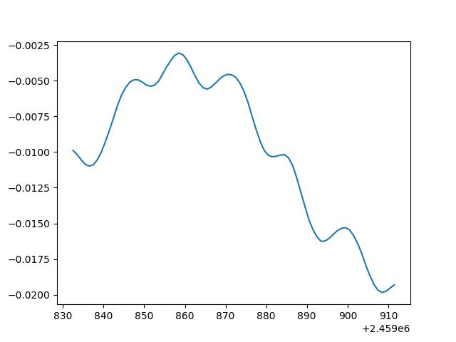

# Time Conversions

The provided script 'time_corr_data_retrieval.py' contains the code that is needed to load (or retrieve from the website if the file is not present locally) the tables for time conversion and leap-seconds.

# UT1-UTC

The first part of the code looks for the 'conversionTable.dat' file locally and downloads it from the website if it cannot find it. Then, given an array of times expressed as Julian days, for each of them the script searches for the corrisponding day in the conversion table and extracts the time correction value UT1-UTC. All of the correction values are stored in an array which is then saved to a new file for the users to implement in their codes (it is also plotted for demonstration purposes).

# TAI-UTC and GPS time difference

The second part of the script looks for the 'leap-seconds.dat' file locally and downloads it from the website if it cannot find it. Then, the file is opened at the last line, which contains the latest leap-second addition and the expression to calculate the TAI-UTC offset. Knowing the date at which GPS was synchronized with UTC an the offset between TAI and UTC at that time, the script computes the current offset between UTC and GPS for the users to implement in their codes.

# Example

In the folder there is already a file named 'JD.dat', which contains some Julian days to be used as demonstration for the code, ranging from 24598325.5 (10 Sept 2022) to 2459911.5 (28 Nov 2022).
The plot of the UT1-UTC differences is the following:

The TAI-UTC difference from the example is 18 s.
